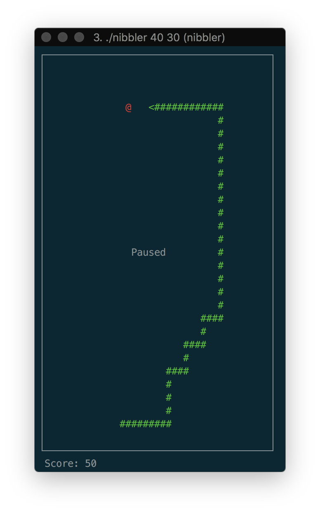
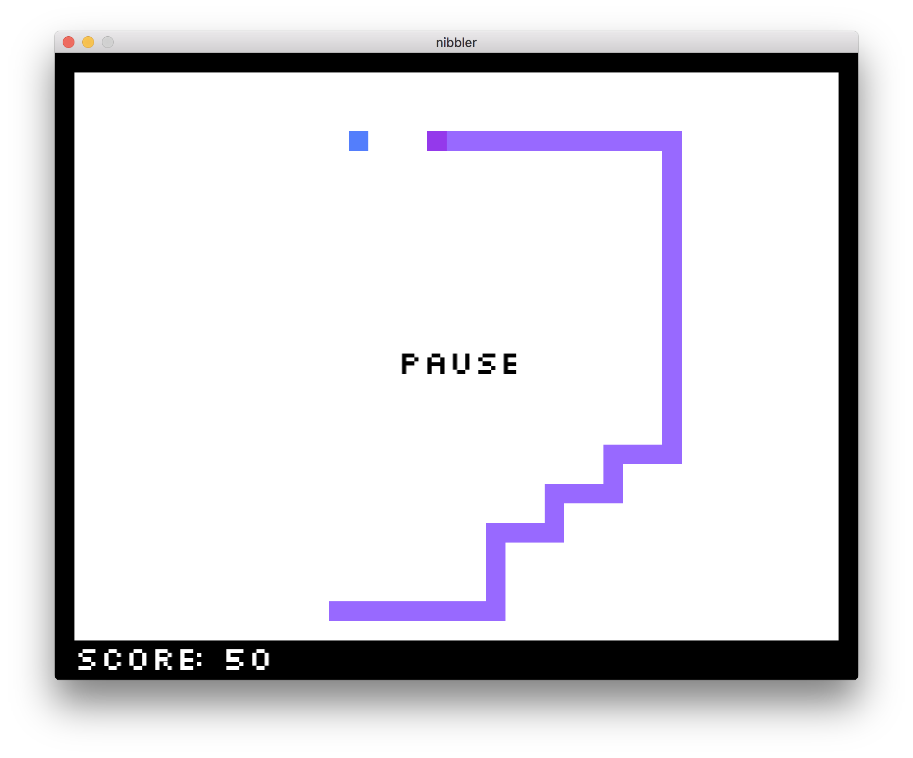
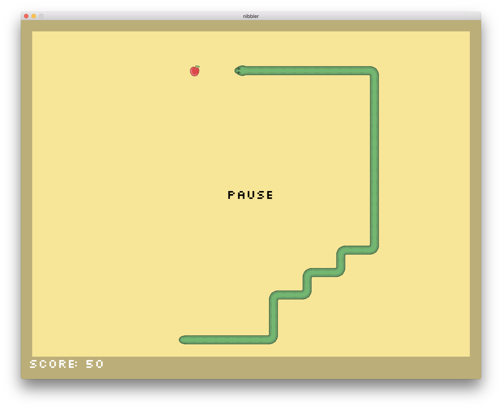

# nibbler
A simple recreation of the classic Snake game employing dynamically loaded visualization libraries






## Usage
`./nibbler [-h] width height`

`-h` enable hard mode - snake accelerates

 * <kbd>wsad</kbd> or <kbd>Up</kbd><kbd>Down</kbd><kbd>Left</kbd><kbd>Right</kbd>
 * <kbd>Esc</kbd> - exit
 * <kbd>Space</kbd> - pause
 * <kbd>1</kbd><kbd>2</kbd><kbd>3</kbd> - select graphics module

## Dependencies
 * clang++
 * ncurses
 * SDL
 * SDL_ttf
 * SDL_image

## Build
`make; make dylib`

On MacOS a simple script has been included to install dependencies through brew.

Install with : `./install.sh`

## Graphics Module Interface
Each graphics module is seperately compiled as a shared object and loaded dynamically during runtime. The game makes calls to the graphics library using the following class interface:

```c++
#ifndef IRENDER_HPP
# define IRENDER_HPP

class IRender {
	public:
		IRender(void) {};
		virtual void init(void) = 0;
		virtual char getInput(void) = 0;
		virtual void destroy(void) = 0;
		virtual void render(void) = 0;
		virtual ~IRender(void) {};
};

#endif
```
A two dimensional char array representing the game state is made available to the library to draw the board.